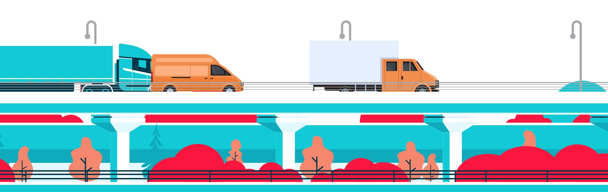

# Connecting suppliers, brokers, and carriers better than ever

### Not every market should be disrupted.  Camion improves the process.
Shipping materials over the road has relied on the supplier-broker-carrier relationship for decades.  Recently, disruptive technologies have tried to remove the broker from the process to increase competition, drive down costs, and simplify the shipping process.  The problem with this approach is that it ignores the function of the broker and pushes any unforeseen logistical challenges (delays, weather, breakdowns, etc.) and detailed coordination of the pickup and drop-off process onto the supplier (consumer) and the carrier (service provider).  In most cases, neither party has anticipated the increased level of effort.

Enter Camion.

Camion leverages the proven, tested function of the broker in the supplier/carrier chain.  Camion provides the same user experience that recent disruptive technologies advertise (ease of use, increased competition) while improving the efficiency of the broker’s role – to worry about the details and respond to unexpected surprises.

* Suppliers create shipping (fulfillment) orders.
* Carriers bid on those orders.
* Brokers connect suppliers and carriers based on their industry knowledge on suppliers’ needs and carriers capabilities, and Camion provides the platform for them to manage ambiguities and unknowns in the process.

---

---
### Hosted on Heroku

A working version of Camion can be found at [https://camion-app.herokuapp.com/](https://camion-app.herokuapp.com/ "Camion")

---
### Technology Used
* React
* Heroku
* Node.JS
* Express.JS
* MongoDB
* Passport
* Axios
* bcrypyjs
* Custom CSS

----
<!-- section complete -->
### © 2020 Built By

 - [Jack Larsen](https://github.com/mememoomoo): Frontend Superstylin' | [LinkedIn](https://www.linkedin.com/in/jack-larsen-760302138/)
 - [Glen Larsen](https://github.com/ultrapancake): Backend & Authentication | [LinkedIn](https://www.linkedin.com/in/glen-larsen-40456a28/)
 - [Randa Viets](https://github.com/rcviets): Frontend, Backend, and The Big Idea | [LinkedIn](https://www.linkedin.com/in/randaviets/)
 - [Mike Carey](https://github.com/careymp1017): Project Management (AFR) | [LinkedIn](https://www.linkedin.com/in/mpcarey/)